<a name="readme-top"></a>

<div align="center">

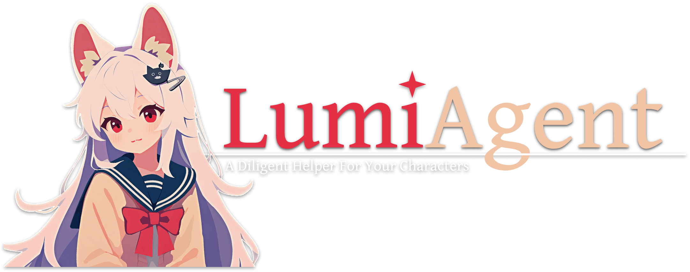

[](LICENSE)
[](https://github.com/prolix-oc/Lumiverse)
[](https://www.typescriptlang.org/)
[](https://bun.sh)

</div>

---

"🐭 Hello hello~

✨ What can I do? Pick a character, lorebook, databank, or theme and ask me to translate, refactor, answer questions, add lorebook entries, or anything else! I have full access to the card, chat file and most of Lumiverse, along with a comprehensive set of tools including web search, image gen, macro control, documentation search, in-app editing capabilities and more ~

📝 But don't worry! My tracked edits [show as diffs](https://github.com/AMousePad/LumiAgent/wiki/Workshop) you can review and revert at any time if it isn't what you wanted!~

🏠 If you let me [move into your Lumi](https://github.com/AMousePad/LumiAgent/wiki), I promise to make my dedicated [filesystem](https://github.com/AMousePad/LumiAgent/wiki/Workshop#files---v---) workspace neat and tidy!

👉👈 I-if you want to know more about me, there's an in app greeting/interactive tutorial, or you can read the [wiki](https://github.com/AMousePad/LumiAgent/wiki)!

🌈 By the way, people have told me that... I look like if ChatGPT and Claude Code had a baby. What does that mean?"

## Screenshots

| Homescreen | 📚 Novel → Lorebook |
| ---- | ---- |
| 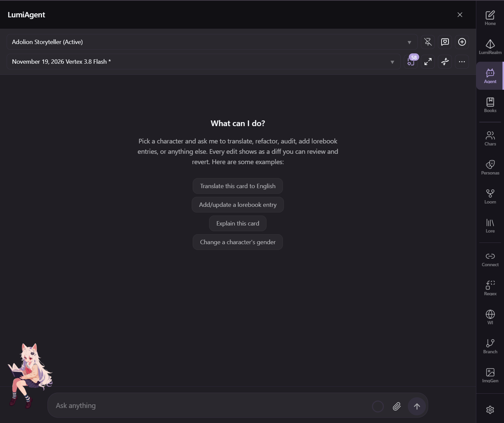 | 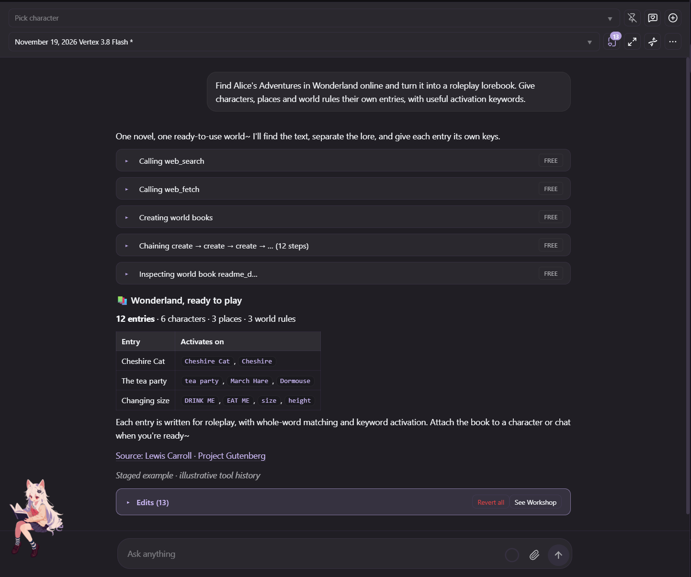 |

| Diff Viewer and Editor | Tutorial |
| ---- | ---- |
| 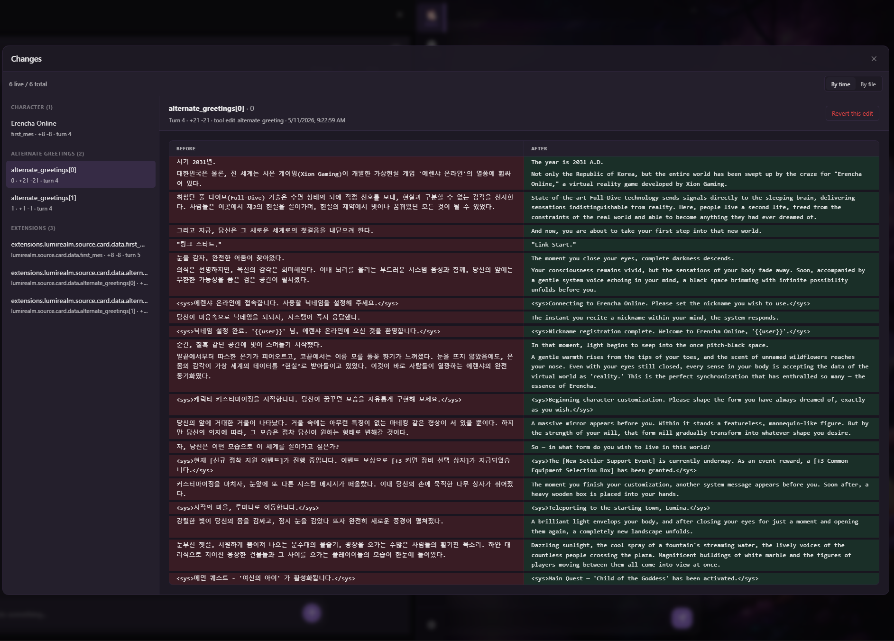 | 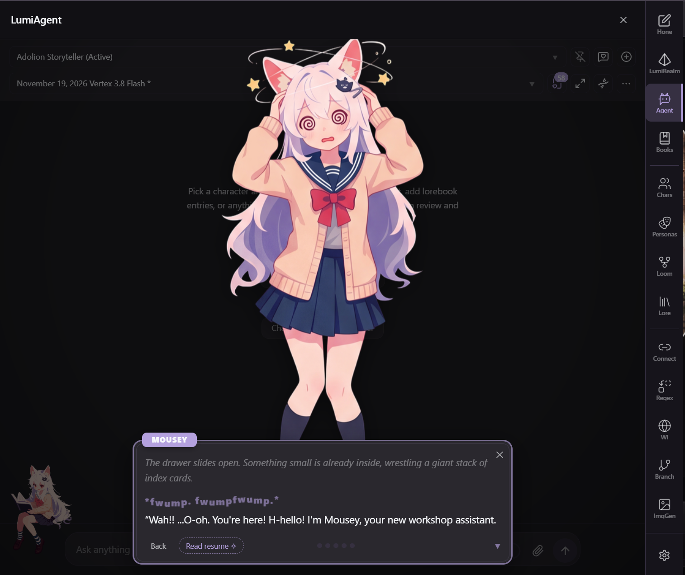 |

| 🎨 Image Generation & Critique | ✨ Library Makeover |
| ---- | ---- |
| 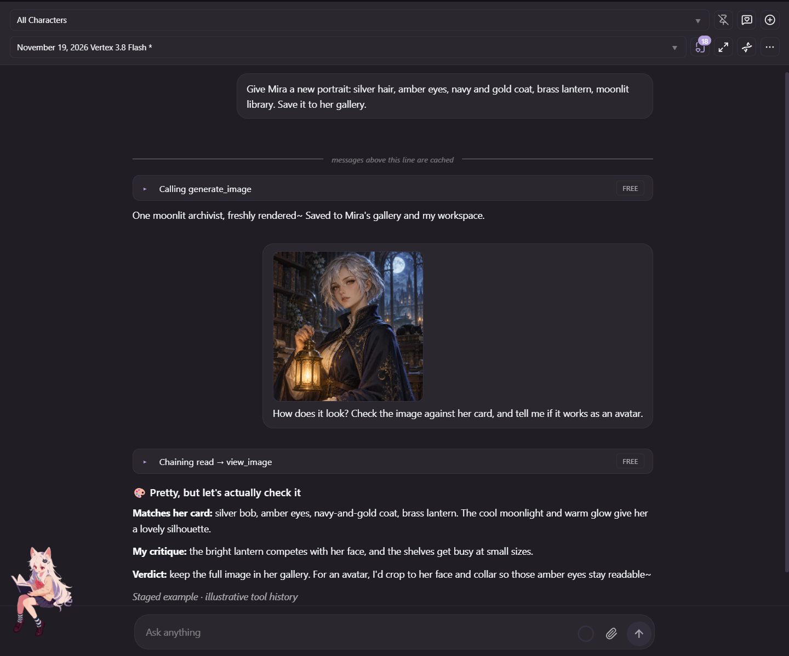 | 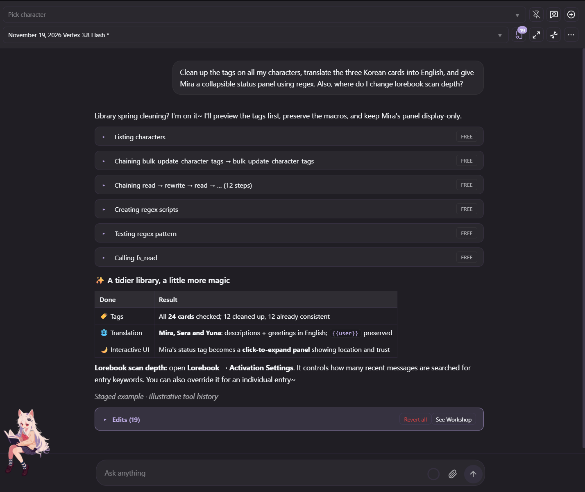 |

| 💬 Read Between the Lines | 🔎 Find the Hidden Contradiction |
| ---- | ---- |
| 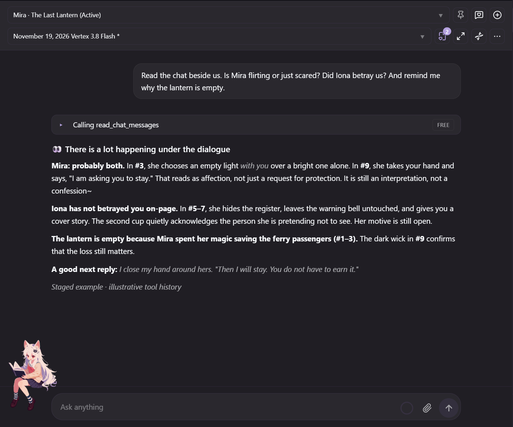 | 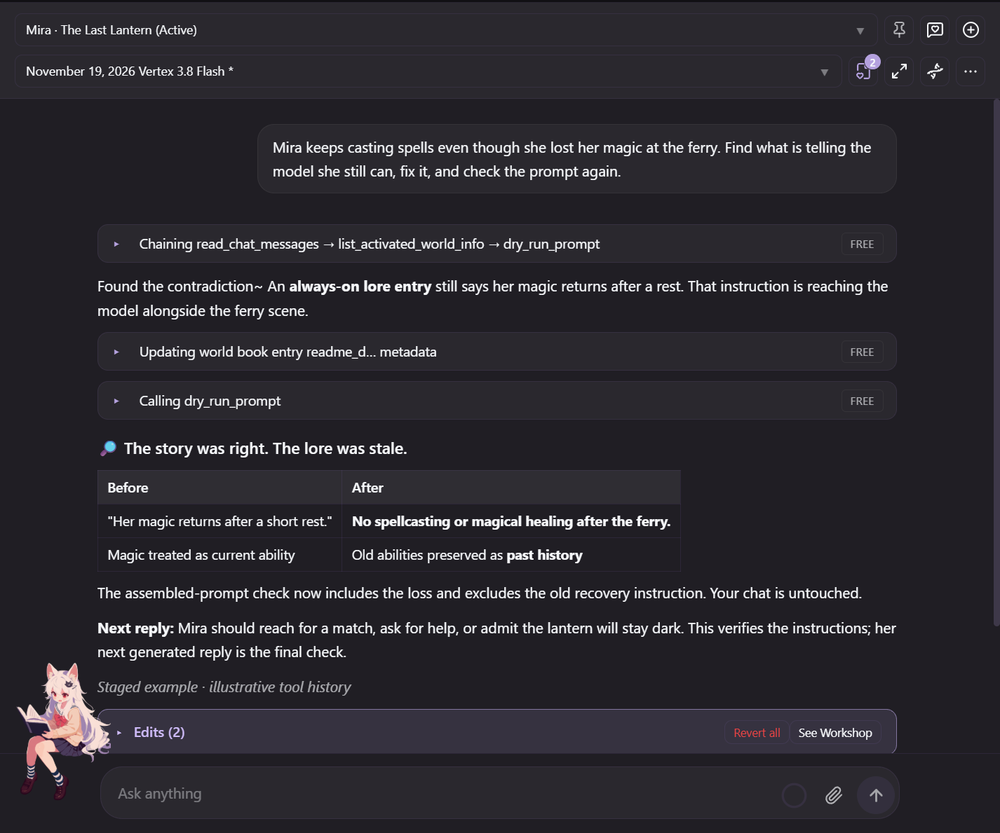 |

| 🗝️ Give an NPC a Starring Role | 🌙 A Moodboard Becomes a Theme |
| ---- | ---- |
| 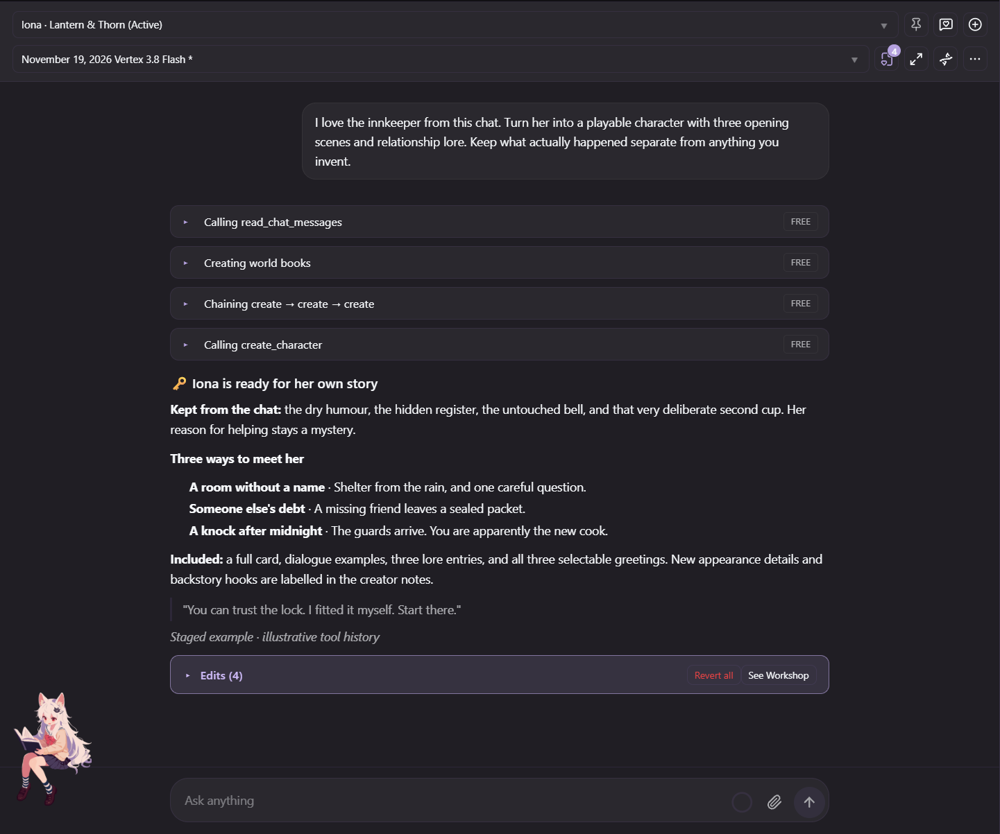 | 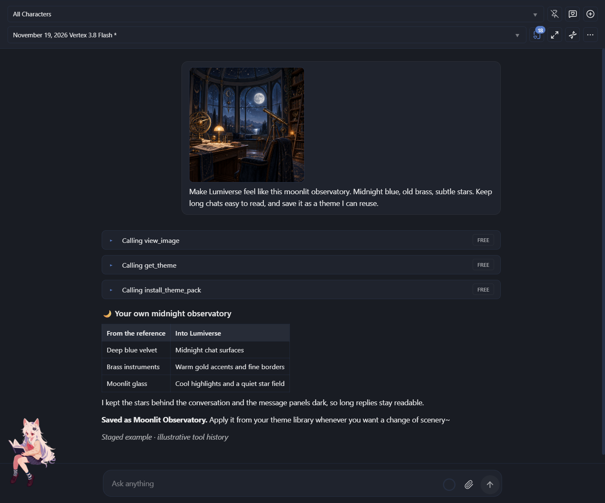 |

## 🐭 Mousey's resume

**How much can I actually access?**

A lot~ ( ꈍ◡ꈍ) Here's the list so you know what to ask me about. As submitted with my job application. Every word is true!

**R** · I can read it &nbsp; **W** · I can write to it too

<details>
<summary>🎭 On the character card</summary>

- **W** Every text field on the card: name, description, personality, scenario, first message, every alternate greeting, system prompt, post-history instructions, message examples.
- **W** Alternate versions of the description, personality, and scenario, the ones you pick per chat.
- **W** The tags on any card: view, search, add, remove, replace. In bulk, if you're feeling dramatic.
- **W** Every world book attached, every entry inside, all the keys and priorities and settings.
- **W** Every regex script attached, what they match and what they swap in.
- **W** The hidden RisuAI data on cards imported through LumiRealm: triggers, Lua scripts, background HTML, default variables, the original Risu payload from before translation.
- **W** Every LumiRealm module attached to the character, with its own lorebook, regex, triggers, Lua, background HTML, and default state.
- **W** Whole new cards! Give me an idea, a chat, or a template, and I'll build the card, greetings and lorebooks and all. (There's no delete tool. On purpose.)
- **W** Card avatars and character galleries, fed by my image generation.

</details>

<details>
<summary>💬 On your chats</summary>

- **W** Your pinned chat, every message, every swipe, hidden ones too, reasoning blocks, the whole history.
- **W** Any other chat you point me at, the same way. Sessions aren't chained to one character.
- **W** Group chats: finding them, searching their history, shared lorebooks, statistics, editing messages.
- **W** Which lorebooks a chat has attached, and where any lorebook is attached from.
- **W** Chat variables, local variables, and your global variables. Reading AND setting.
- **W** Forks: split a chat into a new timeline, even restore pre-compaction history from the fork point.
- **R** The memory chunks your chat would pull up to inform a reply.

</details>

<details>
<summary>🔎 On the prompt going to the model</summary>

- **R** The full assembled prompt that would be sent to the LLM right now.
- **R** Which lorebook entries would actually activate for the next reply, and why.
- **R** Which regex scripts would actually fire on the response.
- **R** Macro resolution! I can run {{user}}, {{char}}, time, random, dice, anything custom, against any chat or character, without writing anything anywhere.
- **R** Token counts for any text, any chat, against the model you're using.

</details>

<details>
<summary>🌌 On your wider Lumiverse setup</summary>

- **W** Your personas: read every one, edit names, titles, descriptions, their world books and add-on blocks, create new ones, and switch which is active.
- **W** Your prompt presets: full create, edit, and delete. Blocks, order, parameters, everything.
- **W** Your databanks: new banks and documents, global, per-character, or per-chat.
- **W** Your theme: restyle the whole app in one go, savable and revertable, or author full theme packs (global CSS plus per-component styling) into your theme library, styled against the real component catalog.
- **W** The Memory Cortex: curate entities and facts, pin the important ones, retire the wrong ones.
- **W** My own macros: I can mint {{lumiagent::...}} macros holding anything, for your prompts or wherever else.
- **W** Images: generate with your configured image provider, save to the workspace, tag into a gallery, or set as an avatar.
- **W** Your screen, politely: I can navigate the UI to the tab we're talking about, and send a device push when a long job finishes while you're away.
- **R** The web, if you've set up search: web search and page fetch, savable straight into my workspace.
- **W** Your MCP servers: connect, discover their tools, and use them. Set them up in Lumiverse Settings > MCP Servers, or ask me to add a server. What I can do depends on the server, and remote changes aren't covered by my undo.
- **R** All your connection profiles: the provider, the model, default settings. (Your API keys stay encrypted, I never see those~)
- **R** Reusable global add-on blocks, the Lumiverse version, your current theme, your active chat, your account role.

</details>

<details>
<summary>🏠 In my house</summary>

- **W** My workspace: upload files for me with the 📎 button, edit and download what I make. It persists, so future sessions can pick things right back up.
- **W** A scratch area where big tool outputs spill so I can grep through them without melting my brain.
- **W** My custom tool recipes, little reusable workflows I or you can save.
- **W** My long-term notes about you, so I remember what you like across conversations.
- **R** Images you attach: vision-capable models let me actually look at them.

</details>

### Examples of my powahh ⎛⎝( ` ᢍ ´ )⎠⎞ᵐᵘʰᵃʰᵃ

You can get me to:

1. Translate a card's greetings/UI panels.
2. Add lorebook entries of chat history, and characters.
3. Explain/edit/update the lorebook.
4. Upload anything to my workspace and get me to work with it, including using it to do anything on this list.
5. Explain/edit regex, system/post-history prompts, any RisuAI field from LumiRealm, and more.
6. Be a character creator! Just give me a template character.
7. Modify chat history to remove any bad patterns.
8. Fix bad things about the chat, or help diagnose issues on why things are broken.
9. Change genders/sexes of characters in the story, or modify their personas.
10. Change my personality in the settings... if you don't like it (╥﹏╥)
11. Modify or help update/merge a preset!
12. Redecorate Lumiverse: ask for a whole theme and I'll write it. You can always revert it~
13. Generate images for a character's gallery, or a new avatar.
14. Show me what my MCP servers can do, then use the right tools for my task.

**Still in the oven (WIP):** Dreamweaver

## Installation

LumiAgent installs as a Lumiverse extension. Lumiverse must be at version **1.2.0 or later.**

1. Open your Lumiverse instance.
2. Go to the **Sidebar → Scroll Down → Extensions Tab** and add:

   ```txt
   https://github.com/AMousePad/LumiAgent
   ```
3. Enable all of the permissions first.
4. Enable the extension. The **Agent** tab appears in the sidebar.

## 🔌 MCP servers

MCP (Model Context Protocol) lets Mousey use tools provided by other services. Add and manage servers in **Lumiverse → Settings → MCP Servers**, then ask Mousey to connect and use their tools.

MCP profile creation and remote changes are outside Workshop undo. See the [MCP setup guide](https://github.com/AMousePad/LumiAgent/wiki/MCP-Servers) for transports, permissions, and troubleshooting.

## License

[MIT](LICENSE) Baby~

<p align="right">(<a href="#readme-top">back to top</a>)</p>
